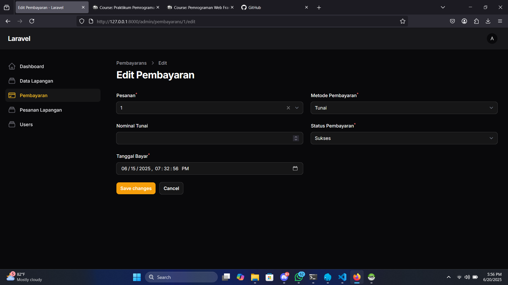
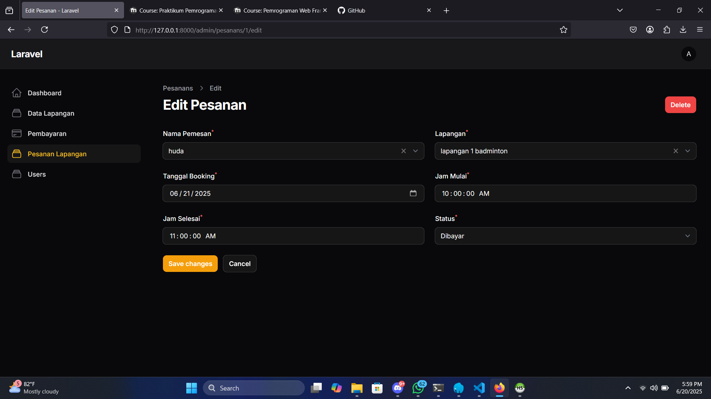

# 🏟️ Aplikasi Manajemen GOR

Aplikasi ini merupakan sistem manajemen dan pemesanan lapangan olahraga untuk pengguna dan admin. Tersedia fitur seperti pemesanan, riwayat transaksi, manajemen pengguna, dan pengelolaan data lapangan.

---

## 📸 Tampilan Antarmuka (UI)

### 👨‍💼 Admin Panel

<table>
  <tr>
    <td align="center">
      <strong>Dashboard Admin</strong> 
      
    </td>
    <td align="center">
      <strong>Login Admin</strong> 
      
    </td>
  </tr>
</table>

### lapangan 🥅
<table> <tr> <td align="center"><strong>Dashboard Data Lapangan</strong> </td> <td align="center"><strong>Tambah Lapangan</strong> </td> </tr> <tr> <td align="center"><strong>Edit Lapangan</strong> </td> <td align="center"><strong>Delete Lapangan</strong> </td> </tr> <tr> <td align="center"><strong>Delete Selected Lapangan</strong> </td> <td align="center"><strong>Search Lapangan</strong> </td> </tr> </table>

### pembayaran
<table> <tr> <td align="center"><strong>Daftar Pembayaran</strong> </td> <td align="center"><strong>Tambah Pembayaran Baru</strong> </td> </tr> <tr> <td align="center"><strong>Edit Pembayaran Menunggu</strong> </td> <td align="center"><strong>Edit Pembayaran Sukses</strong> </td> </tr> <tr> <td align="center"><strong>Delete Pembayaran</strong> </td> <td align="center"><strong>Delete Selected Pembayaran</strong> </td> </tr> </table>

### pesanan lapangan
<table> <tr> <td align="center"><strong>Daftar Pesanan</strong> </td> <td align="center"><strong>Tambah Pesanan</strong> </td> </tr> <tr> <td align="center"><strong>Edit Pesanan</strong> </td> <td align="center"><strong>Delete Pesanan</strong> </td> </tr> <tr> <td align="center"><strong>Delete Selected Pesanan</strong> </td> <td align="center"><strong>Search Pesanan</strong> </td> </tr> </table>

### management user
<table> <tr> <td align="center"><strong>Daftar Users</strong> </td> <td align="center"><strong>Tambah Users</strong> </td> </tr> <tr> <td align="center"><strong>Edit Users</strong> </td> <td align="center"><strong>Delete Users</strong> </td> </tr> <tr> <td align="center"><strong>Delete Selected Users</strong> </td> <td></td> </tr> </table>

---

### 🙋‍♂️ User Panel

<table>
  <tr>
    <td align="center">
      <strong>Beranda</strong> 
      
    </td>
    <td align="center">
      <strong>Booking Lapangan</strong> 
      
    </td>
  </tr>
  <tr>
    <td align="center">
      <strong>Daftar Lapangan</strong> 
      
    </td>
    <td align="center">
      <strong>Daftar Pesanan</strong> 
      
    </td>
  </tr>
  <tr>
    <td align="center">
      <strong>Riwayat Pesanan</strong> 
      
    </td>
    <td align="center">
      <strong>Login</strong> 
      
    </td>
  </tr>
  <tr>
    <td align="center">
      <strong>Pembayaran</strong> 
      
    </td>
    <td align="center">
      <strong>Register</strong> 
      
    </td>
  </tr>
</table>

---

